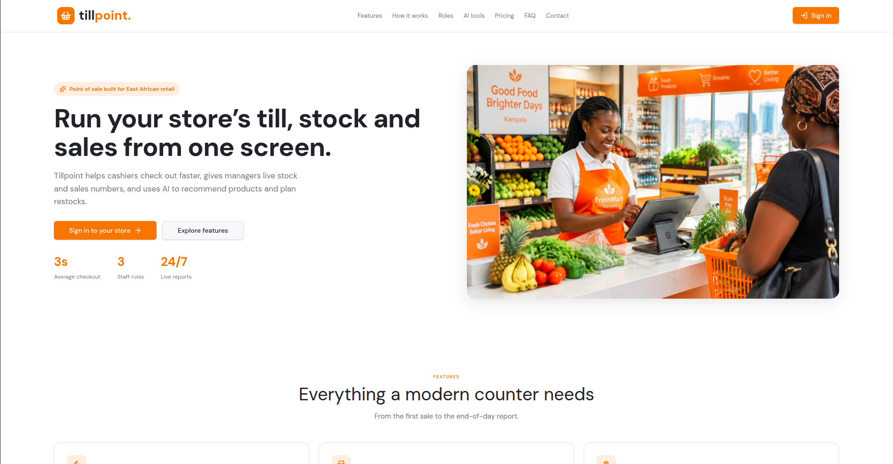
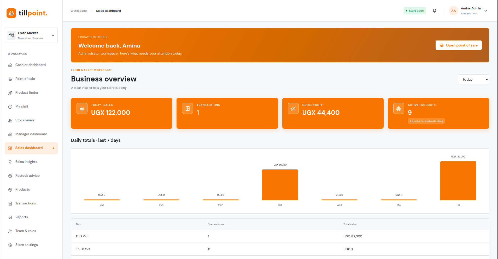
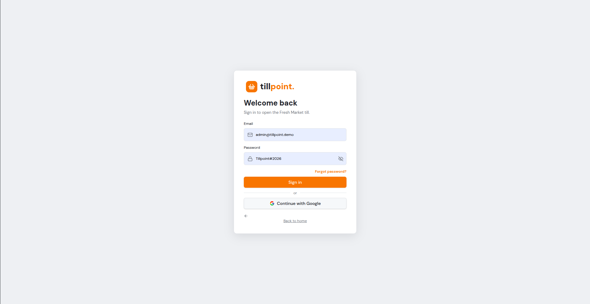
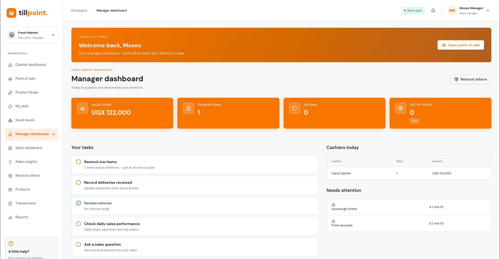

# Tillpoint


Tillpoint is a role-based point-of-sale workspace for Fresh Market. It includes checkout, inventory, sales reporting, staff dashboards, restock advice, and store administration.

## Participant

- **Name:** Wambogo Hassan Sadat
- **Email:** wambogohassan63@gmail.com
- **Phone:** 0786021431

## Challenge Requirements Coverage

### 1. Authentication and Users

Implemented with Supabase authentication and role-based access:

- **Administrator:** Full system access, team management, and store settings
- **Manager:** Reports, inventory management, dashboards, sales performance, and AI insights
- **Cashier:** Product finder, checkout, receipts, inventory visibility, and personal shift reports

### 2. Product Management

Implemented in the Products workspace:

- Add and edit products
- Deactivate products
- Assign categories
- Set buying cost, selling price, stock quantity, and minimum stock level
- Add product images
- Track product codes and SKUs

### 3. Inventory Management

Implemented in the Inventory workspace and checkout flow:

- Automatically reduce stock when a sale is completed
- Add stock and reduce stock through authorized adjustments
- Maintain stock adjustment history and reasons
- Show low-stock alerts and out-of-stock products
- Calculate inventory valuation using stock quantity and buying cost

Supplier management, purchase orders, purchase invoices, and dedicated stock receiving workflows are not currently implemented.

### 4. Sales and POS Interface

The cashier interface supports:

1. Search products
2. Add products to the cart
3. Change quantities
4. Remove cart items
5. Apply discounts
6. Calculate subtotal
7. Calculate the final total
8. Select a payment method
9. Complete the sale
10. Generate and print a receipt

Supported payment methods are Cash, Mobile Money, Card, and Bank transfer.

### 5. Receipts and Checkout Records

Completed sales receive unique receipt records containing the store details, purchased products, quantities, prices, discounts, payment method, totals, cashier, and transaction time. Receipts can be viewed from the sales workspace and printed from checkout.

### 6. Sales Management

Authorized users can:

- View sales and individual receipts
- Search transactions
- Filter by date, cashier, and payment method
- Process permitted refunds
- Export filtered transaction data to CSV

### 7. Business Dashboard

The dashboards provide:

- Today, weekly, and monthly sales views
- Transaction counts
- Total active products
- Low-stock and out-of-stock indicators
- Best-selling products
- Gross profit
- Sales by payment method
- Daily sales charts

Dashboards are role-aware and show each user the information appropriate to their role.

### 8. Reports

The Reports workspace includes:

- Sales reports
- Profit reports
- Inventory reports
- Best-selling product reports
- Low-stock reports
- Sales by cashier
- Sales by payment method
- Date-filtered reporting
- CSV export

PDF export is not currently implemented.

## Competition Submission

Complete the placeholders below before submitting the project.

### 1. Live System URL

`TODO: soon adding the deployed application URL.`

### 2. Test Login Credentials

| Role | Email | Password |
| --- | --- | --- |
| Administrator | `admin@tillpoint.demo` | `Tillpoint#2026` |
| Manager | `manager@tillpoint.demo` | `Tillpoint#2026` |
| Cashier | `cashier@tillpoint.demo` | `Tillpoint#2026` |

### 3. Source Code Repository
https://github.com/Concept-Crashers/orange-glow-pos

### 4. Database Structure and Schema

The database schema is defined in [drizzle/schema.ts](drizzle/schema.ts), with generated migrations in [drizzle/migrations](drizzle/migrations). The main data areas are:

- Profiles and staff roles
- Products and product categories
- Sales, sale items, payments, and refunds
- Inventory adjustments and stock history
- Store settings

Database access is protected with role-based authorization and row-level security policies in Supabase.

### 5. Short Technical Documentation

The application is a TanStack Start and React POS application. Shared POS state is provided by the root-mounted POS provider so the cart, catalog, sales, inventory history, and settings remain available while navigating. TanStack Router handles top-level workspace routes. Supabase provides authentication, persistence, server-side functions, and role-aware database access. AI sales insights and restock recommendations run through role-checked server functions.

### 6. Screenshots

- Sign-in and role selection
- Point of sale checkout
- Business overview dashboard
- Inventory and stock adjustment
- Cashier and manager dashboards
- Restock advice and sales insights

<table>
  <tr>
    <td></td>
    <td></td>
  </tr>
  <tr>
    <td></td>
    <td></td>
  </tr>
</table>


### 7. Technologies Used

- React 19 and TypeScript
- TanStack Start and TanStack Router
- Vite
- Supabase Auth and PostgreSQL
- Drizzle ORM and SQL migrations
- Tailwind CSS and the shared CSS design system
- Radix UI components
- Lucide React icons
- Vitest and Testing Library
- Lovable Cloud and AI Gateway integrations
- GitHub Copilot for AI-assisted development and code review

### 8. Implemented Features

- Role-based access for administrators, managers, and cashiers
- Product catalog and product management
- POS checkout with cart, discounts, payment methods, and receipts
- Inventory tracking, stock adjustments, low-stock warnings, and stock history
- Business overview with sales, transactions, profit, and product KPIs
- Cashier dashboard and personal shift summary
- Manager dashboard with daily activity and attention items
- Sales transactions, refunds, filters, and CSV export
- Sales and inventory reports
- AI sales insights and restock recommendations
- In-stock product finder for customer assistance
- Store settings and team role management
- Responsive layouts for desktop and mobile screens

### 9. Setup and Deployment Instructions

Prerequisites: Node.js, npm, a Supabase project, and the required environment variables.

```sh
git clone <this-repository-url>
cd <repository-name>
npm install
npm run dev
```

For a production check and deployment build:

```sh
npm run lint
npm test
npm run build
```

Configure Supabase credentials and server-side secrets in the deployment environment before publishing. Apply the SQL migrations in [drizzle/migrations](drizzle/migrations) to the target database.

### 10. Optional Demonstration Video

`TODO: Add a short demonstration video URL showing sign-in, checkout, inventory, dashboards, reporting, and AI advice.`

## Lovable Development

This project was built with [Lovable](https://lovable.dev). Continue development in the [Lovable editor](https://lovable.dev/projects/0243843a-e010-4fcd-a61c-56f56ca5f428).
